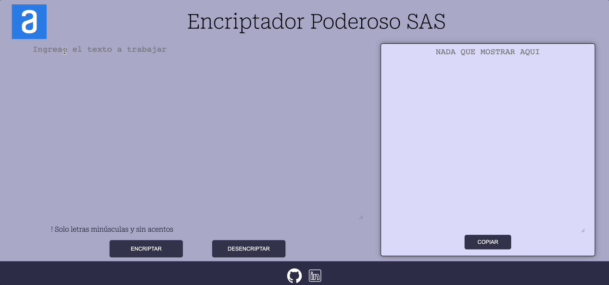

# Hola, bienvenido a mi aplicación de encriptación!

Este es mi resultado del **Challenge encriptador - ONE - Oracle Next Education**

Descifrando el  **mensaje secreto!!**

Tecnologías utilizadas:

    

Gracias por la visita! Pueden ver la pagina en **https://sebasatelier.github.io/encriptadorPower/**

Saludos! 

Sebastián
